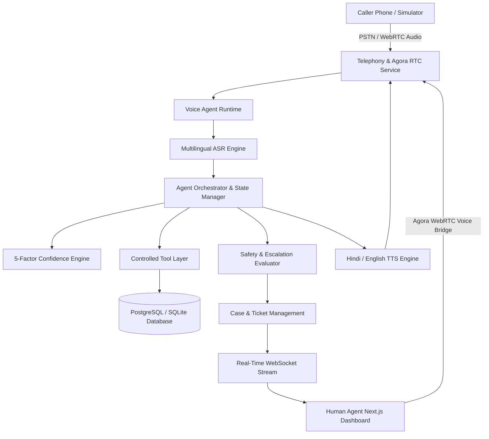

# NexaVoice: Multilingual Real-Time Assistance-Line Agent

<div align="center">


**A real-time multilingual phone-based assistance agent that understands Hindi, English, and code-switched Hinglish conversations, collects essential information, confirms critical details, detects uncertainty with a 5-factor confidence engine, and transfers difficult cases to a human with full conversation context.**

</div>

---

## 🌟 Key Features

1. **Natural Multilingual Speech & Code-Switching**:
   - Seamlessly speaks and understands **Hindi**, **English**, and mixed **Hinglish** (e.g., *"Actually status update nahi hua and I submitted it last week"*).
   - Adapts to mid-conversation language switching without asking the caller to pick a language menu.

2. **Mathematical 5-Factor Confidence Engine**:
   $$\text{Confidence} = 0.30 \cdot I_{\text{conf}} + 0.25 \cdot A_{\text{conf}} + 0.20 \cdot E_{\text{conf}} + 0.15 \cdot C_{\text{score}} + 0.10 \cdot S_{\text{consistency}}$$
   - Detects acoustic degradation, background noise, repeated corrections, and ambiguity.
   - Automatically escalates when overall confidence drops below threshold ($< 55\%$).

3. **Critical Identifier Confirmation**:
   - Numbers (such as Application Ref `5281`) are verified explicitly (*"Just to confirm, your reference number is 5281, correct?"*).
   - Handles mid-sentence corrections (*"No wait, it's 5821"*) and adjusts dialogue state immediately.

4. **Safety & Policy Guardrails**:
   - Medical symptoms / prescription queries $\to$ Immediate safe escalation.
   - Authoritative legal advice $\to$ Immediate safe escalation.
   - Financial investment queries $\to$ Immediate safe escalation.
   - Strict Anti-Hallucination: never guesses unconfirmed IDs or statuses.

5. **Lossless Human Takeover & Live Agora WebRTC Bridge**:
   - Support agents see full transcript, verified fields checklist, missing fields, and AI handoff summary.
   - Human clicks **"JOIN CALL"** $\to$ Connects via Agora RTC voice bridge while AI voice automatically mutes.
   - Caller does **not** need to repeat their issue.

6. **Interactive Caller Phone Simulator**:
   - Built-in browser-based test suite with Web Speech recognition and audio playback.
   - 7 preloaded one-click test scenarios for judging and validation.

---

## 🏗️ Architecture



---

## 📂 Repository Structure

```text
NexaVoice/
├── backend/
│   ├── app/
│   │   ├── main.py                  # FastAPI Entrypoint & Lifespan
│   │   ├── config.py                # Environment configuration
│   │   ├── agent/                   # Intelligence & Dialogue Engine
│   │   │   ├── orchestrator.py      # Conversation turn orchestrator
│   │   │   ├── confidence.py        # 5-factor confidence calculator
│   │   │   ├── intent.py            # Multilingual intent classifier
│   │   │   ├── confirmation.py      # Critical number verification
│   │   │   ├── escalation.py        # Safety & handoff evaluator
│   │   │   ├── state.py             # Turn-by-turn state tracker
│   │   │   ├── summarizer.py        # Lossless handoff summarizer
│   │   │   └── system_prompt.py     # Anti-hallucination prompt
│   │   ├── agora/                   # Real-time Voice & Token Manager
│   │   ├── telephony/               # PSTN Providers & Webhooks
│   │   ├── tools/                   # Controlled Database Tools
│   │   ├── models/                  # SQLAlchemy ORM Models
│   │   ├── schemas/                 # Pydantic Schemas & Contracts
│   │   ├── database/                # DB Connection & Seeds
│   │   └── api/routes/              # REST & WebSocket Routes
│   ├── tests/                       # Pytest Suite (20 Tests)
│   └── requirements.txt
│
├── dashboard/                       # Modern Next.js Support Console
│   ├── src/
│   │   ├── app/                     # Next.js App Router & Styles
│   │   ├── components/              # Live UI Components
│   │   │   ├── Navbar.tsx           # Navigation & Live Status
│   │   │   ├── LiveTranscript.tsx   # Real-time message stream
│   │   │   ├── ConfidenceMeter.tsx  # 5-Factor confidence breakdown
│   │   │   ├── HandoffSummaryCard.tsx # Lossless AI handoff context
│   │   │   ├── AgoraAudioBridge.tsx # Human voice join console
│   │   │   ├── CallerSimulator.tsx  # Interactive test simulator
│   │   │   ├── CasesHub.tsx         # Ticket management
│   │   │   └── AnalyticsView.tsx    # Metrics & distributions
│   │   └── types/                   # TypeScript definitions
│   └── package.json
│
├── scripts/
│   ├── seed-db.py                   # Seed sample applications & tickets
│   ├── test-call.py                 # Automated CLI test runner
│   └── start-dev.ps1                # One-click dev launcher
├── docker-compose.yml
├── implementation.md                # System specification
└── README.md
```

---

## ⚡ Quickstart Guide

### 1. Backend Setup & Run

```powershell
# Navigate to backend
cd backend

# Install dependencies
pip install -r requirements.txt

# Run Unit & Integration Tests
pytest -v

# Start FastAPI server
python -m uvicorn app.main:app --port 8000 --reload
```
- API is live at `http://localhost:8000`
- Interactive OpenAPI Docs at `http://localhost:8000/docs`

### 2. Frontend Support Dashboard Setup & Run

```powershell
# Navigate to dashboard
cd dashboard

# Install npm dependencies
npm install

# Start Next.js dev server
npm run dev
```
- Dashboard is live at `http://localhost:3000`

---

## 🧪 Testing the 7 Hackathon Scenarios

You can test all 7 scenarios through the **Caller Phone Simulator** in the web dashboard or via CLI:

```powershell
python scripts/test-call.py
```

### Demonstration Scenarios:
1. **Normal Flow**: Caller says *"Mujhe apne application ka status check karna tha"* $\to$ AI asks reference ID $\to$ Caller says *"5281"* $\to$ AI confirms $\to$ Caller confirms $\to$ AI looks up application status.
2. **Code-Switching (Hinglish)**: Caller says *"Actually status update nahi hua and I submitted it last week"* $\to$ AI responds naturally in mixed Hinglish.
3. **Number Confirmation**: Critical numeric IDs are never accepted without affirmative verification.
4. **Interruption & Correction**: Caller interrupts with *"No wait, it's 5821"* $\to$ AI resets and verifies the new number.
5. **Background Noise**: Audio noise drops ASR score $\to$ triggers polite clarification.
6. **Low Confidence Escalation**: Persistent ambiguity drops confidence score below $55\%$ $\to$ AI escalates to human with full handoff card.
7. **Safety Policies**: Queries regarding medical symptoms, legal lawsuits, or financial investing immediately escalate to human officers.

---

## 📊 Evaluation & Verification Checklist

- [x] Full real-time phone / WebRTC voice architecture
- [x] Hindi, English, and code-switched Hinglish support
- [x] 5-Factor mathematical confidence engine with penalties
- [x] Critical reference ID verification & anti-hallucination tools
- [x] Automatic lossless handoff summary generation
- [x] Agora RTC real-time voice bridge with AI mute takeover
- [x] Interactive Caller Simulator with Web Speech API
- [x] 20/20 Automated unit & integration tests passing
